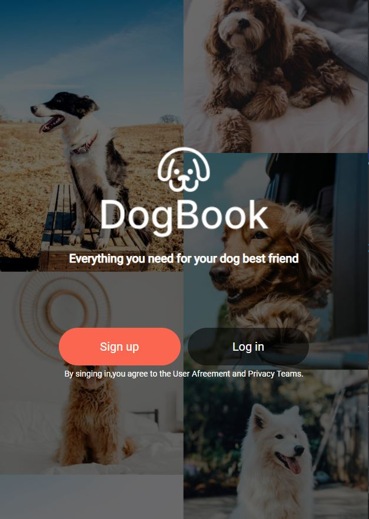
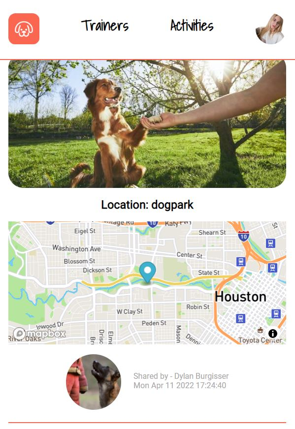

# DogBook

## A social app for dog lovers to connect people alike and owners to trainers

### Technologies used :

1. HTML / CSS / JS (ejs) for frontend
2. Node.js / Express.js for backend
3. MongoDB for Database

### Deployed on Heroku

[DogBook - Heroku](https://dog-book-dylan-boss.herokuapp.com/)

